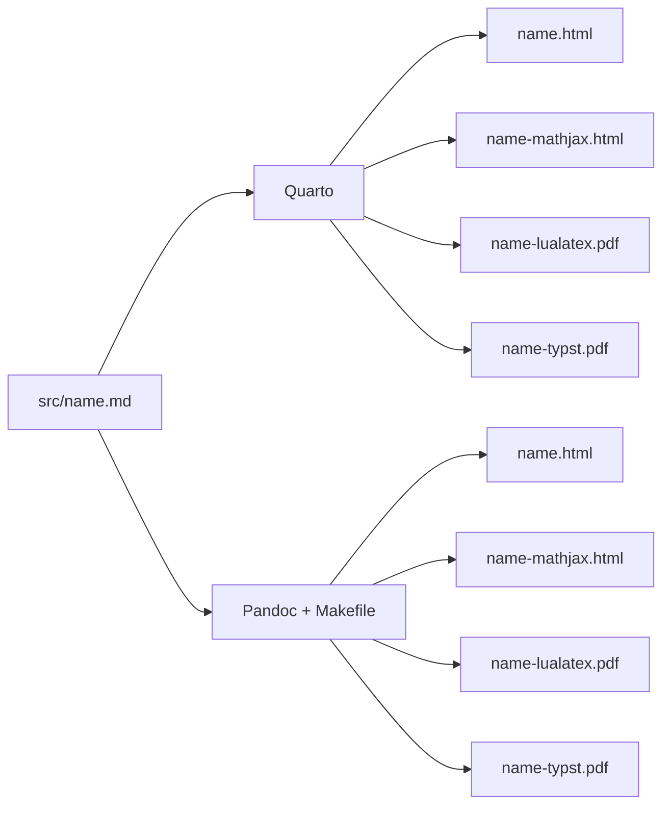
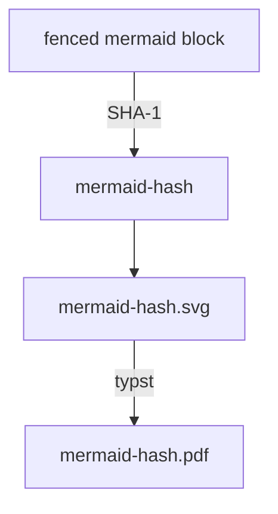

---
# Metadata used by both Quarto and vanilla Pandoc.
title: "Diagrams in the same face as the prose"
lang: en
toc: true
toc-depth: 3

# Quarto-only render recipes. Vanilla Pandoc ignores this `format` map and uses
# the four explicit defaults files under ../config/ through the root Makefile.
format:
  html:
    output-file: mermaid.html
    html-math-method: mathml
    css: assets/fonts.css
    filters:
      - ../config/mermaid.lua
    theme:
      light: flatly
      dark: darkly
    respect-user-color-scheme: true
    code-copy: true
    code-overflow: wrap
    email-obfuscation: javascript
    format-links:
      - text: MathJax 4 HTML
        href: mermaid-mathjax.html
        icon: filetype-html
      - pdf
      - typst
  mathjax4-html:
    output-file: mermaid-mathjax.html
    css: assets/fonts.css
    filters:
      - ../config/mermaid.lua
    theme:
      light: flatly
      dark: darkly
    respect-user-color-scheme: true
    code-copy: true
    code-overflow: wrap
    email-obfuscation: javascript
    format-links:
      - text: MathML HTML
        href: mermaid.html
        icon: filetype-html
      - pdf
      - typst
  pdf:
    output-file: mermaid-lualatex.pdf
    filters:
      - ../config/mermaid.lua
      - ../config/absolute-links.lua
    link-base: https://font.kolen.dev
    pdf-engine: lualatex
    # .github/tl_packages is the declared package set. Left on, Quarto reacts to
    # a log warning by installing babel-greek, whose greek.ldf then collides with
    # the `babelfont` setup below; without it babel uses its own el locale, which
    # is what every working build here has used.
    latex-tinytex: false
    latex-auto-install: false
    mainfont: TeX Gyre Schola
    mathfont: TeX Gyre Schola Math
    monofont: JetBrains Mono
    babelfonts:
      greek: Gentium
      hebrew: Ezra SIL
      # Font filename stem: OSFONTDIR finds the Regular and Bold files.
      chinese-hant: NotoSansCJKtc
  typst:
    output-file: mermaid-typst.pdf
    filters:
      - ../config/mermaid.lua
      - ../config/absolute-links.lua
    link-base: https://font.kolen.dev
    mainfont: TeX Gyre Schola
    mathfont: TeX Gyre Schola Math
    codefont: JetBrains Mono
    include-in-header: ../config/fonts.typ
---

A diagram is typeset text with lines around it, and it is the place where a
document most easily stops being set in its own face. The picture below is the
subject of this page and its own illustration: it is drawn from a fenced
`mermaid` block in this file, and every label in it is TeX Gyre Schola, in all
eight renderings of this page.

This is one of two diagram patterns here, and the portable one. The other uses
[Quarto's own mermaid support](/mermaid-quarto.html), writes no filter and keeps
no generated files, and gives that up in exchange: four outputs instead of
eight, and a raster in the PDFs instead of text. That page compares them
directly; this one explains how eight renderings are reached.



That is the shape of the whole repository, and it is also the reason this page
needs any machinery at all. Two tools, four outputs each, one source between
them --- so a diagram has to survive eight renderings, and the font has to
survive them with it.

## Why Quarto's own mermaid support is not what is used

Quarto renders mermaid natively, and it is the obvious first answer. It is not
usable here, for two independent reasons.

The first is decisive on its own. A native diagram is an executable cell,
```` ```{mermaid} ````, and Quarto refuses those outside a `.qmd`:

    ERROR: You must use the .qmd extension for documents with executable code.

Every source here is a `.md`, because the Makefile reads the same file Quarto
does. Renaming the sources to `.qmd` would end that.

The second is that it would only ever have answered half the question. Quarto
draws mermaid in the browser for HTML, and shells out to a headless Chrome for
PDF; vanilla Pandoc has no mermaid support at all, in any format. Four of the
eight outputs would still have needed something written here, and the four
Quarto did handle would have been drawn by two different renderers --- the
browser's mermaid and Chrome's --- with no guarantee the pictures matched.

What those PDFs would contain is worth naming too, because it is the difference
this pattern exists for. Quarto's PDF diagram is a **raster** --- and only if
`mermaid-format: png` is set, since the default and `svg` both drop the picture
and still exit zero. The pictures below are vector, and their labels are real
text in an embedded Schola subset, selectable and searchable like the prose.
[The other page](/mermaid-quarto.html) is that pattern, written out.

So the diagram is a plain ```` ```mermaid ```` fenced block, which is also what GitHub
renders when it displays this file, and one Lua filter loaded by all four
recipes turns it into a picture.

## One picture, three ways of reading it

`config/mermaid.lua` replaces the block with the artifact its writer can read.
The SVG is drawn ahead of time by `pixi run render-diagrams` and checked in; the
PDF is derived from it by the build.

| Writer   | What it is given               | How the family is resolved                   |
|----------|--------------------------------|----------------------------------------------|
| HTML     | the SVG, inlined into the page | `@font-face`, from `assets/fonts.css`        |
| Typst    | the same SVG, as a file        | `TYPST_FONT_PATHS`, embedded as a CID subset |
| LuaLaTeX | a PDF derived from that SVG    | already embedded, by the step that made it   |

The HTML row is the one with a trap in it. An `` pointing at the SVG would
have been the natural markup and would have got the font wrong: an SVG loaded
through `` is a separate document that cannot see the page's `@font-face`
rules, and browsers block external subresource loads inside it, so it has no
route to the face by either path and its labels come out in a fallback. Inlined
into the page, the `font-family` inside the SVG resolves against exactly the
faces the body text uses.

Typst reads SVG directly, and resolves the family named inside it against the
same font tree the rest of the Typst recipe uses. That is why the labels are
real text in the Typst PDF, and why they are searchable and selectable rather
than being outlines.

LuaLaTeX is the one that cannot be given the SVG. `\includegraphics` reads no
SVG without `--shell-escape` and an Inkscape installation, which is a large
dependency to add to a build that otherwise needs only Pandoc, TeX and Typst. So
the PDF is made by Typst --- already pinned here, already resolving these
families --- from the same checked-in SVG. Deriving it rather than rendering it
twice is what stops the two pictures from disagreeing, and it is also what keeps
it out of the repository: it is the SVG that is expensive to make, not this.

## What has to be true when the picture is drawn

Mermaid has no renderer that is not a browser. It measures every label with
`getBBox()` and lays the diagram out around the answer, so the box widths in the
SVG are measurements of a particular face at a particular size. They are
measurements of TeX Gyre Schola here, which means the font must be installed on
the machine that renders the diagram, not only on the machine that reads it:

``` sh
pixi run setup
pixi run render-diagrams
```

Get that wrong and nothing fails. The labels are re-drawn in Schola by every
consumer downstream, inside boxes that were sized for whatever mermaid actually
measured --- so the diagram comes out subtly wrong, text crowding its borders,
rather than coming out broken.

Two settings in `scripts/render_diagrams.py` make the rest of it work.
`fontFamily` is the one that names the face. `htmlLabels: false` is the one that
makes the file readable at all outside a browser: mermaid's default label is an
HTML `<foreignObject>` embedded in the SVG, which only a browser can draw ---
Typst warns about it and renders an empty picture. Turned off, labels are SVG
`<text>`, which every consumer here understands.

## Why the SVG is checked in, and the PDF is not

The SVG is a generated file in the repository, which this project otherwise
avoids. The alternative is worse: drawing it at build time would make a browser
and an npm fetch dependencies of `pixi run build`, on every machine that renders
the site and in CI, to redraw a picture that changes about as often as the prose
around it.

`bin/script-ranges.lua` is the same trade made the same way --- generated by an
explicit task from a pinned upstream, checked in, so that nothing the build runs
downloads anything.

The PDF is the same reasoning read the other way, and it reaches the opposite
answer. Nothing about it is expensive: it is a pure function of the SVG beside
it, and the tool that computes it is Typst, which this project already pins and
already runs as a PDF engine. Checking it in would buy nothing and cost a binary
in the history on every edit to a diagram, so it is gitignored and built ---
by a pattern rule in the `Makefile` on one side, and by `_quarto.yml`'s
`pre-render` on the other, both calling the same script so that the Typst
invocation has one definition rather than three.

That split is the whole rule: **a browser decides what is committed.** The one
artifact that needs one is in the repository; the one that does not is not.

What that trade normally costs is staleness: an edited diagram, an old picture,
and no complaint from anything. It does not cost that here, because the SVG is
named for the SHA-1 of the diagram source rather than for the document it
appears in:



Editing a diagram changes its name. The old SVG no longer answers to it, and the
filter stops the render:

    no rendered diagram at src/diagrams/mermaid-4f2b9c1e0a77.svg
    The diagram source changed, or has never been rendered.
    Run `pixi run render-diagrams` and commit the SVG it draws.

The name is computed from the code block's text as *Pandoc* parses it, on both
sides: the filter calls `pandoc.utils.sha1`, and the generator reads the sources
through `pandoc --to json` rather than with a regular expression, so the two can
never disagree about what was hashed. `pixi run render-diagrams` also sweeps
drawings no source asks for any more, which is the only thing that would
otherwise accumulate.

### What the name cannot carry

A drawing depends on how it was drawn as well as on what it says, and the name
cannot say so: it is the hash of the diagram source alone, because
`config/mermaid.lua` derives the same name from the same string and knows
nothing about the renderer. Change the pinned mermaid-cli, the theme, the family
or the background, and every checked-in SVG becomes a picture of the old
settings while still answering to the name the filter asks for.

So the settings are written out beside the drawings, in
`src/diagrams/renderer.json`, and compared rather than assumed. When they differ,
every diagram is stale at once --- `render-diagrams` redraws all of them and
`render-diagrams-check` fails:

    stale renderer: src/diagrams/renderer.json is missing or does not match
    this script's settings, so every drawing is one of the old ones
    Run `pixi run render-diagrams`.

The file is written last, after the drawing is done, so an interrupted run
leaves it saying what is true --- that the pictures on disk are still the old
ones.

## The colours are fixed, and the plate is white

An SVG's colours are decided when it is drawn. This site has a light theme and a
dark one, so a diagram with dark labels on a transparent ground would be
unreadable on half of it. The diagrams are therefore rendered on white, and read
as a plate on both --- which costs nothing in a PDF, whose page is white
already.

That is the one place where a rendered diagram is less adaptable than the text
around it. Text on this site changes colour with the theme; these labels do not.
